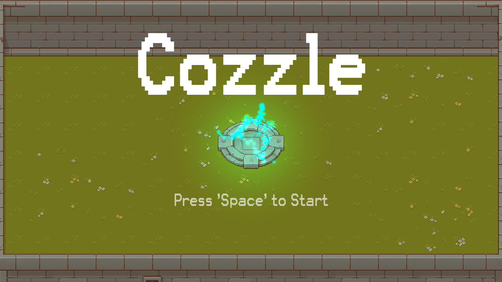

# Cozzle
## Overview
Duality Themed Puzzle
Two characters are bounded to one control but in reverse. Our main task is to move them to a teleportation 
pod at the same time. We will face interesting puzzles on the way.

	

<!--  -->

## Play the game.
Play from [here](https://dioveath.itch.io/cozzle)

## Concepts & Ideas
### Initial Design 
The theme for 2022 was Duality. I decided to go with Unity this time. On the first day 
I was exploring ideas and my initial idea was to create a puzzle platformer with 2 characters
where both characters help each other to reach to next level. 
Unfortunately, I was running out of interesting ideas. So, I decided to put them nicely
in to recycle bin. 
My next idea was to create a 2d top-down puzzle. I created 2 characters, gave them some 
basic colors. I started to add Player Script as well as PlayerController Script. My idea 
was to control one character at a time and the control will propagate to another character 
but in the opposite direction. In the actual script, I would simply switch out the rigid body 
to control and to control and gave the other opposite velocity of the same control. 

### Mechanics
This would result in movement like this. I was testing and modifying some data to best
fit and feel good for the game. Being satisfied with the control, It was time to add some 
levels to play. In Unity, it was very easy to create levels using tilemaps. I added 
TileMap Object and TileMap Layer. And stopped by a moment to open up MSPaint and create 
a simple tile to test out the tilemaps.
I laid out tiles to create a boundary and added a collider to work as an actual boundary. 
It was working fine. And I got an idea to make a puzzle where both characters need to reach 
the same point with the double- control. So, I begin testing the mechanics of the 
game, to get used to controls and find some interesting scenarios for puzzle levels. With 
some testing I found out a way to move one character and not other using some obstacles. 
This became an important concept for the game.

### Playtests
After working a few hours on the game, I added some graphics. and I was able to
created up to 5 levels for the game. And I was still play-testing the game to find 
some edge-cases. It was already 11:30 PM, so I decided to stop for the day. I saved 
all the changes and went to bed.

### Polishing
On Day 2, I was focusing on fixing bugs and polishing the game.  
With some simple script and added sprite, I added an indicator to indicate 
which character is being controlled. Although, it was a small feature, it added lot
of value to player.
And then, I decided to add some animation to the game. I did all the animation 
using DOTween. I added some simple scale tween for character spawn animation. 
After being done with the animation, I moved to Lighting the scene. As this was 
a 2D game, I upgraded to use the Universal render pipeline for 2D Lighting. 
Upgrading turned all sprites black, as there will be no 2D Light in scene. I added 
Global 2D Light and messed a bit with settings. And finally, I added some particle system
for the final point to be more like a teleport chamber. I played a bit with settings
and made a simple particle system for teleport.

### Final scene
At last minute, I decided to add final scene for the game. I just copied and pasted the 
first level and added texts there. After being done with final scene. I build the
game and submitted to itch.io 20 minutes before deadline.
